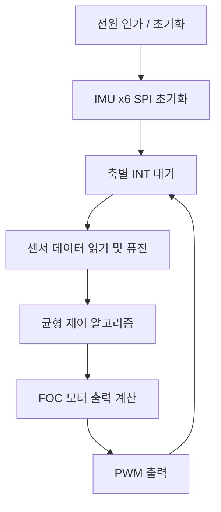

# 코드 구조

코드 작성에 들어가기 전에 전체 흐름과 모듈별 로직을 순서도/논리도로 먼저 정리하는 문서입니다. 각 섹션은 TODO 상태이며, 순서도/논리도가 확정되는 대로 채워 넣습니다.

## 1. 시스템 개요

- MCU: ESP32-S3 1개로 3축(IMU 6개, 서보 3개, CAN 통신) 전체 제어
- IMU 기종: **ICM-42688-P** 기본, **MPU-6500** 대안. 두 기종 모두 TDK InvenSense 제품으로 SPI 배선과 핀 배정이 동일해 교체 시 하드웨어 변경 없음 ([README.md](README.md) IMU 센서 선정 참고)
- 개발 순서: 1축 → 2축 → 3축 확장 ([README.md](README.md) 참고)

## 2. 전체 순서도 (TODO)

> TODO: 위 순서도는 최상위 골격만 잡은 상태입니다. 축 확장(2축/3축), CAN 통신 타이밍, 서보 제어 타이밍이 어디에 끼어드는지 확정 후 보완합니다.

## 3. 센서 입력 처리 로직 (TODO)

- IMU SPI 공통 버스 읽기 순서 (CS 6개 순차 선택)
- 축별 INT(GPIO9/10/11) 트리거 시 처리 흐름
- 센서 퓨전 방식 (상보필터 / 칼만필터 등 미정)
- **기종 의존부 격리**: 초기화·원시값 읽기만 기종별로 분리하고, 그 위(퓨전·제어)는 공통 코드로 둡니다. 두 기종의 차이는 초기화 레지스터와 데이터 버스트 순서(ICM-42688-P는 온도→가속도→자이로, MPU-6500은 가속도→온도→자이로)뿐입니다. 원시값은 두 기종 모두 가속도 g, 자이로 dps로 정규화해 넘깁니다.
- **기종 판별**: `WHO_AM_I`(0x75) 값으로 자동 구분합니다. ICM-42688-P는 `0x47`, MPU-6500은 `0x70`. 6개 센서가 섞여 있어도 개별 판별이 가능합니다.
- **SPI 클럭**: MPU-6500이 섞여 있으면 레지스터 접근을 1 MHz 이하로 제한해야 합니다. 전부 ICM-42688-P면 24 MHz까지 올릴 수 있습니다.
- **축 방향 보정**: 기종이 바뀌면 칩 내부 축 방향이 달라질 수 있습니다. 퓨전 단계로 넘기기 전에 기종별 축 부호/순서 매핑 테이블을 한 번 거치게 합니다.

## 4. 균형 제어 로직 (TODO)

- 제어 알고리즘 선정 (PID / LQR 등 미정)
- 1축 → 2축 → 3축 확장 시 로직 재사용 방식
- 튜닝값 실시간 조정 인터페이스 (키 입력 / 무선 컨트롤)

## 5. 모터 출력 로직 (TODO)

- FOC 벡터 제어 계산 흐름
- in1/in2/in3 PWM 생성
- INA240 전류센서 ADC 3핀 샘플링 및 보정

## 6. 통신 로직

- CAN(GPIO1 TX, GPIO2 RX) 프레임 정의: **[CAN_프로토콜.md](CAN_프로토콜.md) 참조** (ID 배정, 메시지 페이로드, 워치독 규칙 확정)
- 물리 계층 검증 완료 (500kbit/s, RTT 503us, 유실 0%)
- 송수신 흐름 구현 (TODO)
- 서보모터 3개(GPIO48/47/21) 제어 명령 흐름 (TODO)

## 7. 모듈별 논리도 (TODO)

- 각 모듈이 확정되는 대로 mermaid 다이어그램 추가
