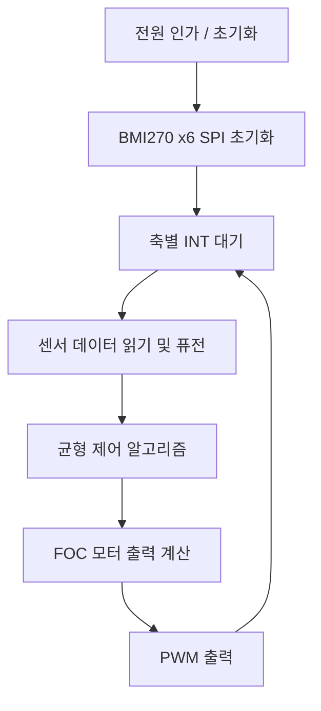

# 코드 구조

코드 작성에 들어가기 전에 전체 흐름과 모듈별 로직을 순서도/논리도로 먼저 정리하는 문서입니다. 각 섹션은 TODO 상태이며, 순서도/논리도가 확정되는 대로 채워 넣습니다.

## 1. 시스템 개요

- MCU: ESP32-S3 1개로 3축(6개 BMI270, 3개 서보, CAN 통신) 전체 제어
- 개발 순서: 1축 → 2축 → 3축 확장 ([README.md](README.md) 참고)

## 2. 전체 순서도 (TODO)

> TODO: 위 순서도는 최상위 골격만 잡은 상태입니다. 축 확장(2축/3축), CAN 통신 타이밍, 서보 제어 타이밍이 어디에 끼어드는지 확정 후 보완합니다.

## 3. 센서 입력 처리 로직 (TODO)

- BMI270 SPI 공통 버스 읽기 순서 (CS 6개 순차 선택)
- 축별 INT(GPIO9/10/11) 트리거 시 처리 흐름
- 센서 퓨전 방식 (상보필터 / 칼만필터 등 미정)

## 4. 균형 제어 로직 (TODO)

- 제어 알고리즘 선정 (PID / LQR 등 미정)
- 1축 → 2축 → 3축 확장 시 로직 재사용 방식
- 튜닝값 실시간 조정 인터페이스 (키 입력 / 무선 컨트롤)

## 5. 모터 출력 로직 (TODO)

- FOC 벡터 제어 계산 흐름
- in1/in2/in3 PWM 생성
- INA240 전류센서 ADC 3핀 샘플링 및 보정

## 6. 통신 로직 (TODO)

- CAN(GPIO1 TX, GPIO2 RX) 프레임 정의 및 송수신 흐름
- 서보모터 3개(GPIO48/47/21) 제어 명령 흐름

## 7. 모듈별 논리도 (TODO)

- 각 모듈이 확정되는 대로 mermaid 다이어그램 추가
